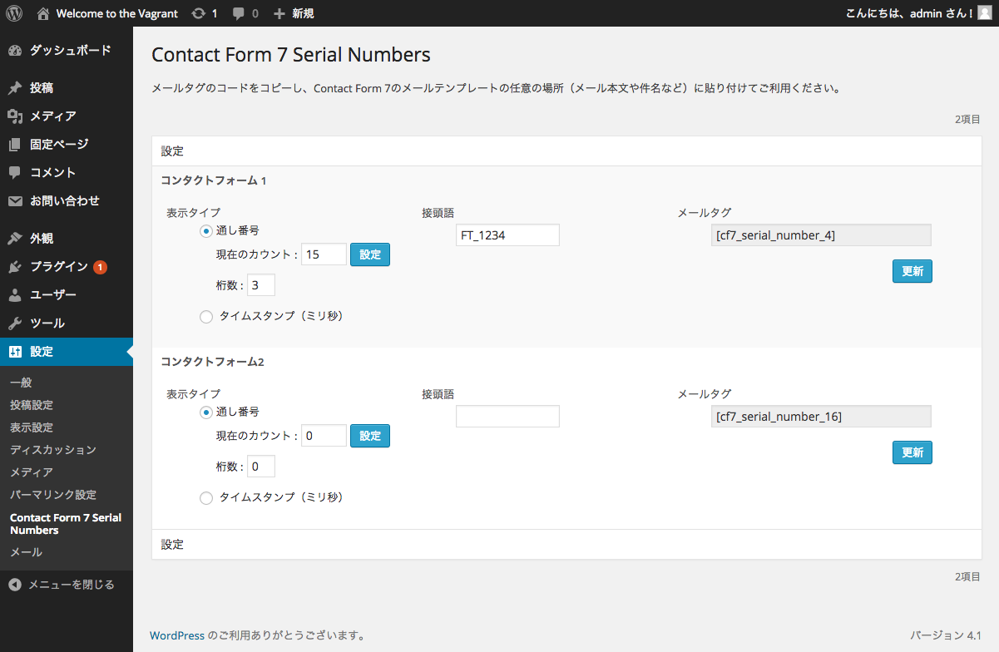

# Contact Form 7 Serial Numbers #
**Contributors:** Kiminori KATO
**Tags:** contact form
**Requires at least:** 3.9 or higher
**Tested up to:** 4.2.2
**Stable tag:** 0.7.0
**License:** GPLv2
**License URI:** http://www.gnu.org/licenses/gpl-2.0.html

## Description ##

"Contact Form 7 Serial Numbers" is a extension plugin of "Contact Form 7",
that add Serial Numbers or Timestamp into the mail from forms.

## Installation ##

1. Upload `contact-form-7-serial-numbers` folder to the `/wp-content/plugins/` directory
1. Activate the plugin through the 'Plugins' menu in WordPress.

You will find 'Contact Form 7 Serial Numbers' menu in your WordPress admin panel's 'Settings' menu.

## Frequently Asked Questions ##

## Screenshots ##

Edit Settings in the Admin panels.

## Changelog ##

### 0.7.0 - 2015/07/07 ###
* Added: Confirmed work with Contact Form 7 4.2.1
* Added: Confirmed work with Wordpress version 4.2.2
* Improved: Improved count-up processes at the time of using of "Contact Form 7 add confirm" plugins.

### 0.6 - 2015/01/29 ###
* Added: Confirmed work with Contact Form 7 4.0.3, 4.1
* Added: Confirmed work with Wordpress version 4.1
* Added: Added the setting button that changes count number value
* Added: Added the ShortCode 'wpcf7sn_view_count' that display the recent serial numbers

### 0.5.2 - 2014/11/26 ###
* UPDATED: Updated so that the requires as least wordpress version is 3.9 or higher.
* UPDATED: Updated the tested up to wordpress version.

### 0.5.1 - 2014/11/06 ###
* Update: Updated this documents which had forgotten to update.

### 0.5 - 2014/11/06 ###
* Changed: Changed Text Doamin to "contact-form-7-serial-numbers"
* Changed: Changed behavior during uninstall plugins to uging "uninstall.php"

### 0.4 - 2014/10/30 ###
* Internationalized. ( English, Japanese )

### 0.3 - 2014/10/29 ###
* Bug fix: Fixed a bug that counts up each time when many times pasted the mail tag.

### 0.2 - 2014/10/28 ###
* Added the processing that restore options value from backing up when you enable this plugin.
* Added the processing that backing up options value when you disable this plugin.
* Added the processing that erase options value and backing up files, when you uninstall this plugin.

### 0.1 - 2014/10/27 ###
* Initial Release.

## Upgrade Notice ##

### 0.7.0 ###

Nothing.
